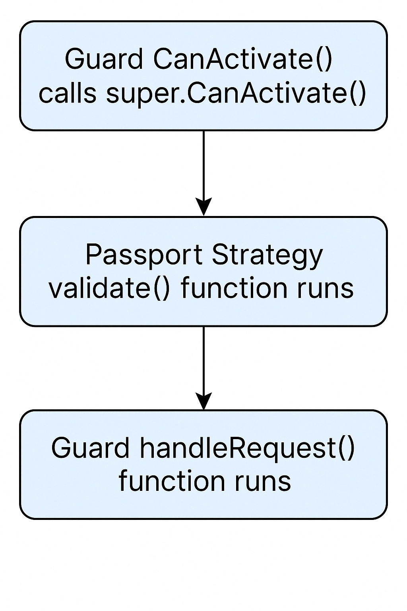

# 🛡️ Passport Guard Authentication Flow

이 문서는 NestJS에서 Passport 인증 가드가 작동하는 순서를 설명합니다.

## 🔁 작동 순서

1. Guard의 `canActivate()`가 호출되고 `super.canActivate()` 실행
2. Passport Strategy의 `validate()` 함수 실행
3. Guard의 `handleRequest()`에서 사용자 객체 반환
